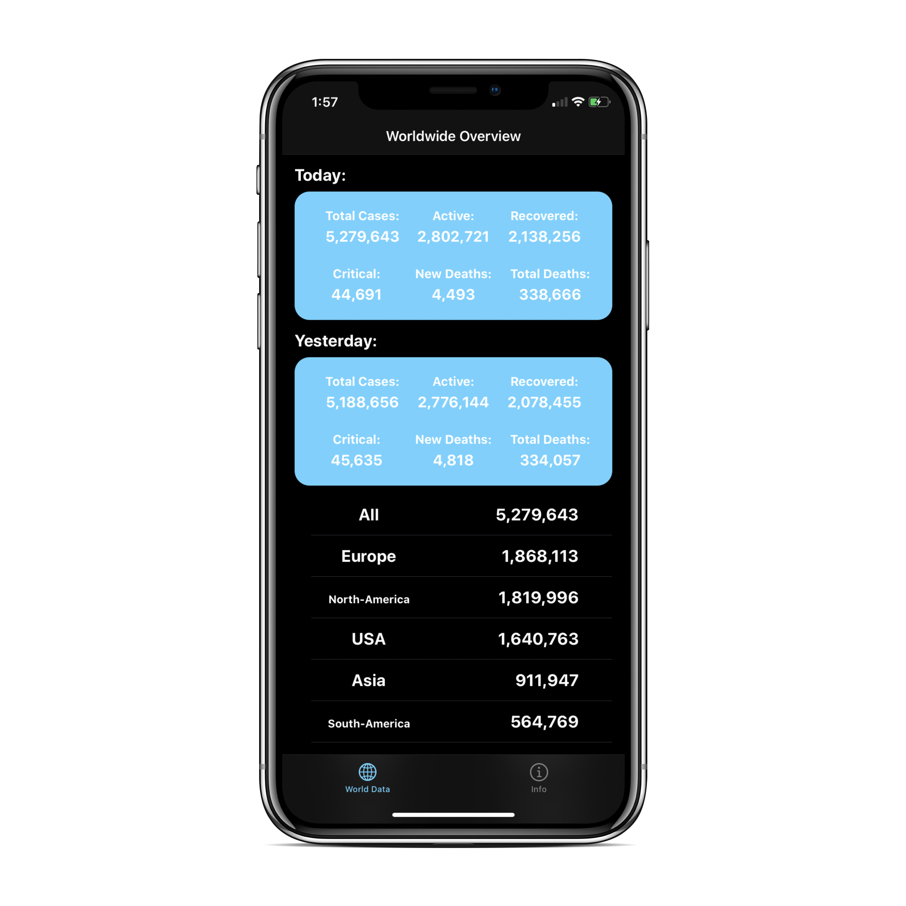
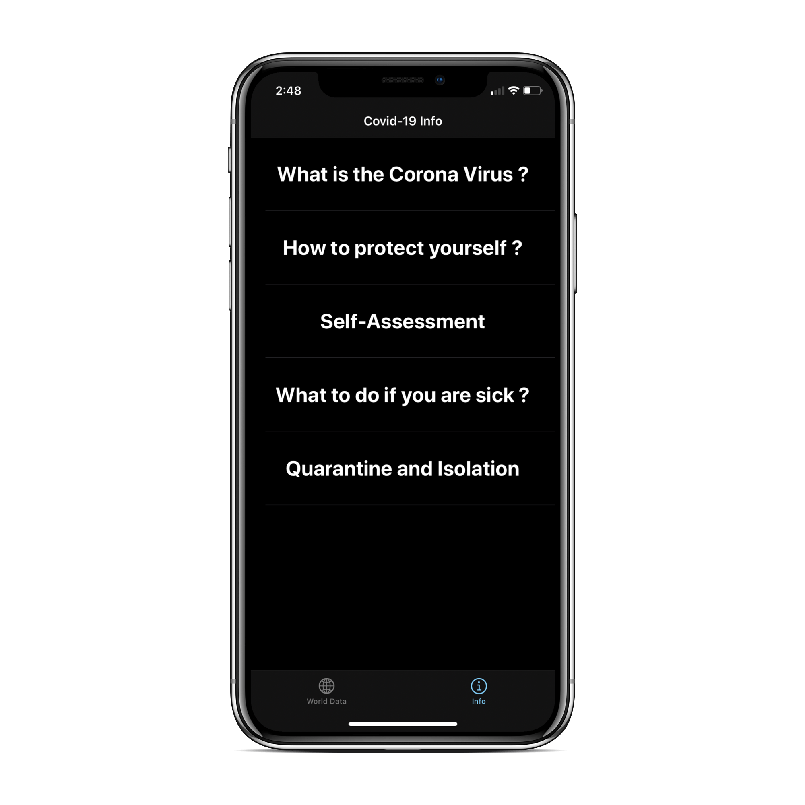

# Covid-Log

iOS app to analyze the Corona Virus epidemic with data being pulled from https://api-sports.io/documentation/covid-19. This app makes use of programtic UI, network requests, stacks, and tableviews. Covid-Log should work for all iPhone devices running iOS 13. 

  

 
